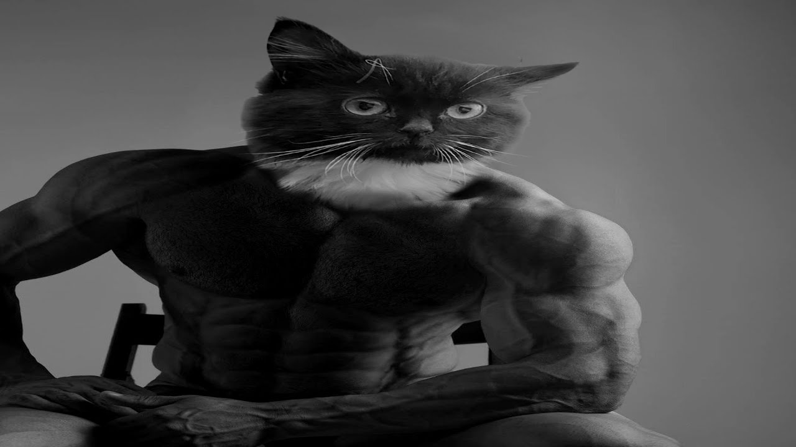

# Gigachad maker
Создаёт gif анимацию из статичной картинки. На самом деле можно использовать не только гигачад-фото, а и любое другое, но программа изначально создавалась именно чтобы создавать гигачад-гифки.

## Пример
```
pip install -r requirements.txt
source venv/bin/activate
python example.py
```

Для примера я использую вот такую картинку из интернета: 



Получаем вот такую штуку:


